# DriveNow - Vehicle Management System

## Graphic Flow of Design Architecture

### 1. Project Architecture

```text
       [Dependency Injection (Factories)]
                  | injects into
                  v
[API Controllers / Routers]
                  |
                  v
         [Business Services] -----> (Publishes Event to Queue)
                  |
                  v
           [Repositories]
                  |
                  v
        [PostgreSQL Database]
```

### 2. Message Queue Flow

```text
[Business Services]
       |
       | (Publishes Event)
       v
   [RabbitMQ]
   (Message Queue)
       |
       | (Listens & Consumes)
       v
[Metrics Worker] ---> Updates -> [Prometheus Gauges]
```

### 3. Docker-Compose Interaction Flow

```text
                      [Client]
                         |
                 (HTTP)  |  Port 8000
                         v
       +------------------------------------+
       |          drivenow_api              |
       +------------------------------------+
         |                 |             ^
  (SQL)  |          (AMQP) |             | (HTTP) Fetch Metrics
         v                 v             |
 [drivenow_db]     [drivenow_rabbitmq]   |
                           ^             |
                   (AMQP)  |             |
                           |             v
       +------------------------------------+
       |        drivenow_metrics_worker     |
       +------------------------------------+
```

### 4. Database Schema

```text
 +-------------------+           +--------------------------+
 |       cars        |           |         rentals          |
 +-------------------+           +--------------------------+
 | id (UUID)         |<----------| car_id (UUID)            |
 | model (String)    |  1 to N   | id (UUID)                |
 | year (Integer)    |           | customer_name (String)   |
 | status (Enum)     |           | start_date (Date)        |
 | created_at (Date) |           | end_date (Date)          |
 | updated_at (Date) |           | created_at (Date)        |
 +-------------------+           | updated_at (Date)        |
                                 +--------------------------+
```

## Database Choice

**Why I chose PostgreSQL over NoSQL (e.g. MongoDB):**
I think PostgreSQL is a better choice than a NoSQL database for this project for a few simple reasons:

1. **Related Data:** A car rental system is relational. Rentals belong to specific cars. PostgreSQL makes sure the data connects correctly and avoids issues like renting a car that isn't available.
2. **Safe Transactions:** When multiple things happen at once (like renting a car), PostgreSQL ensures the database updates safely without any mix-ups.
3. **Easy Searching:** Using SQL makes it much easier to write queries that link different pieces of data together for reports in the future.

## How to Run the Project

```bash
docker-compose up -d --build
```

All dependencies, the database, the message broker, the metrics worker, and the core API will automatically build and start inside docker containers.

## How to Use the API

The easiest way to interact with the API is via the fully documented Swagger UI:

- **Swagger Docs:** [http://localhost:8000/docs](http://localhost:8000/docs)

## A Brief Architecture Description

This system is built using a decoupled, service-oriented architecture:

- **REST API:** Built with FastAPI. It uses **Middlewares** to track performance and provides a simple way to manage the car fleet.
- **Service Layer:** This is where the main business rules live. It uses **Dependency Injection** to keep the code clean and easy to test.
- **Data Persistence:** Uses **PostgreSQL** to save data. This ensures all information about cars and rentals is kept safe and organized.
- **Asynchronous Processing:** Uses **RabbitMQ** to send metrics data to a background worker. This worker does the actual work of tracking Prometheus metrics.
- **System Utilities:** Includes a **ConfigManager** to handle settings and a **Logger** that saves logs to both the console and a file for easy monitoring.
- **Automated Tests:** Uses **Pytest** to test the system. It tests the API routes to make sure they work correctly and the service layer to verify all business logic.

## Example usage

This section walks you through how to use the system step-by-step.

### Step 1: Start the program

Run `docker-compose up -d --build` to start all the services. Once everything is running, you can follow the steps below in the Swagger UI.

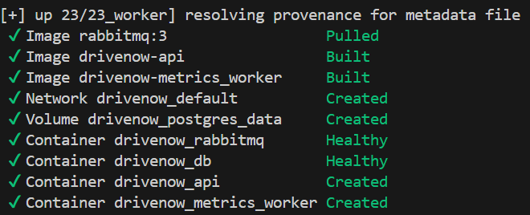

### Step 2: Adding a new Car to the fleet

Open your web browser and go to [http://localhost:8000/docs](http://localhost:8000/docs). First, you need a car to rent out. Go to the **POST /cars** section and create a car. You just need to give it a model name (like "Kia") and a year (like 2021). When you click "Execute", the system will save the car and give it a unique ID.

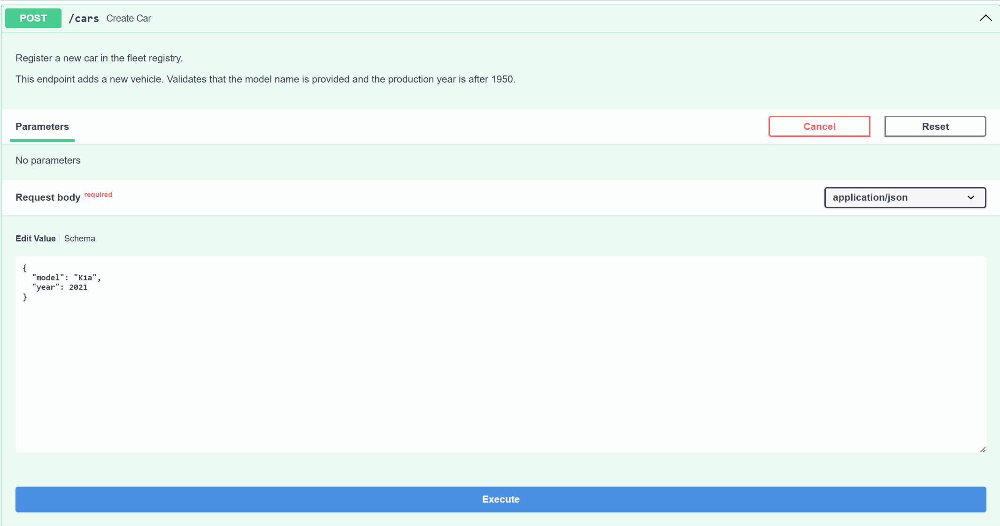
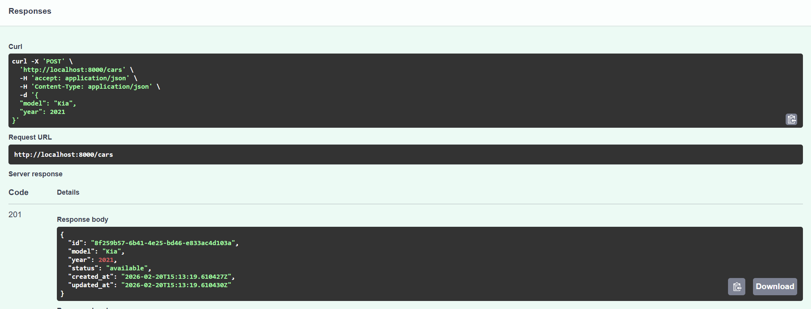

### Step 3: Finding your Car's ID

To do anything with your car, you need its ID. Go to the **GET /cars** section and click "Execute". You will see a list of all your cars. Look for the car you just made and copy the "id" value.

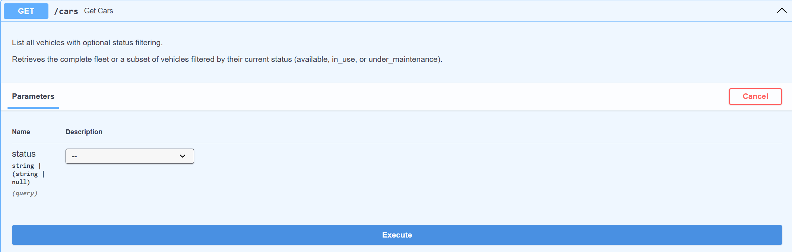
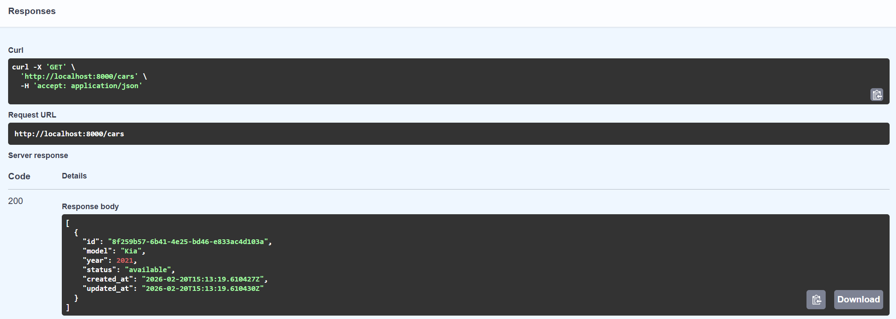

### Step 4: Updating car information

If you want to change the car's name or year, you can update it. Go to the **PUT /cars/{id}** section. Paste your car's ID into the box and enter the new information you want to save (in this example, I chose to change the name to "Kia Picanto").

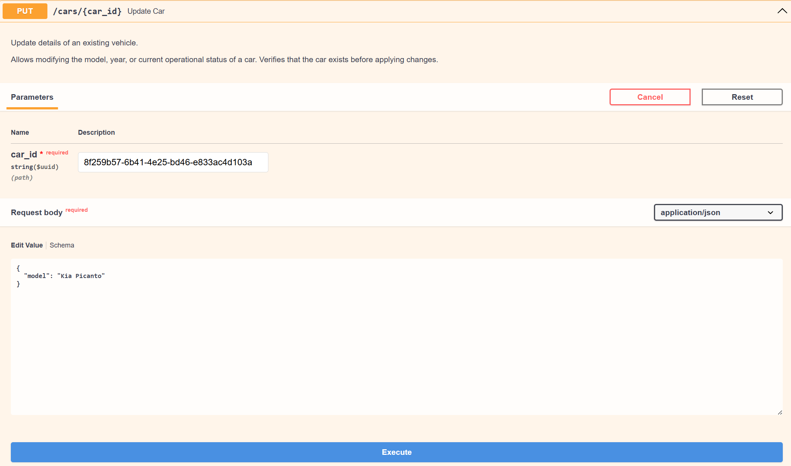
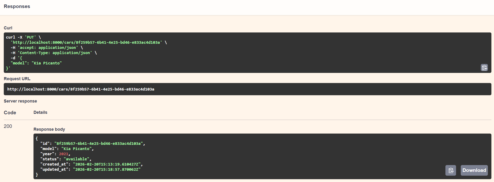

### Step 5: Starting a new Rental

Now it is time to rent the car to a customer. Go to the **POST /rentals** section. Paste the car's ID into the car_id box and type in the customer's name, for example: "Moshe Binieli". When you execute this, the car is officially rented (you will notice that the `end_date` is still null because the car has not been returned yet).


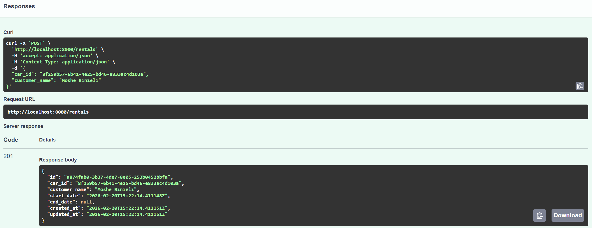

### Step 6: Seeing that the car is "In Use"

The system is smart! If you go back to the **GET /cars** section and look at your car list again, you will see that the status of your car has automatically changed from "available" to "in use".

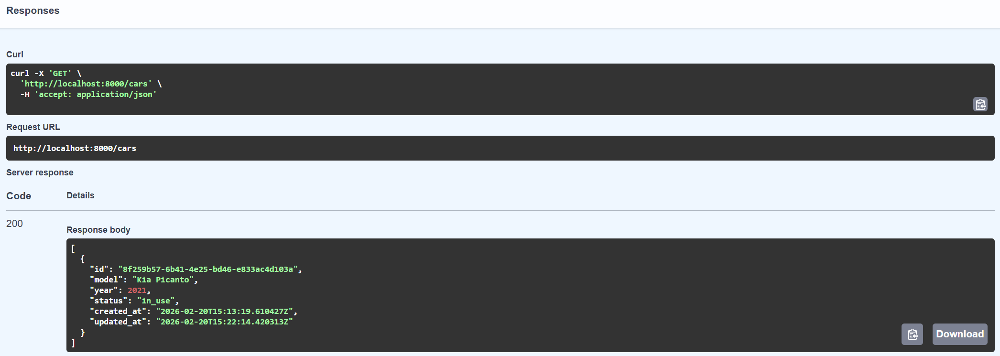

### Step 7: Finishing the Rental

When the customer returns the car, you need to end the rental. Go to the **PATCH /rentals/{car_id}/end-rental** section. Paste the car's ID and click "Execute". This tells the system the car is back (you will see that the `end_date` is now filled with the return date and is no longer null).

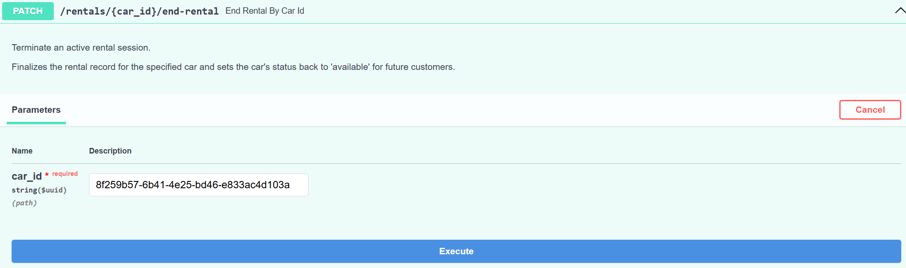
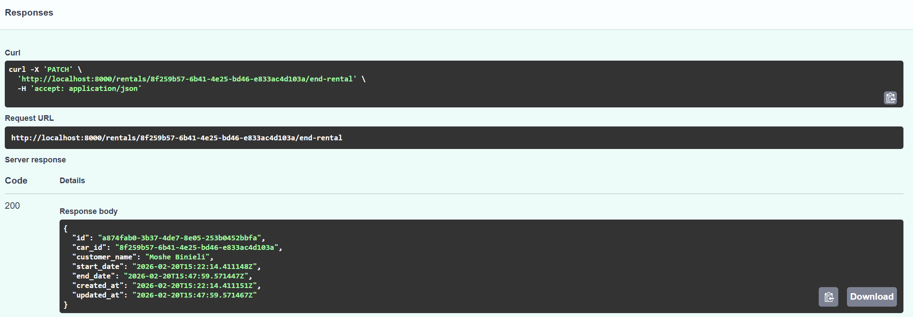

### Step 8: Seeing that the car is "Available" again

If you check the **GET /cars** list one last time, you will see the status is back to "available". This means the car is ready for the next person to rent it.

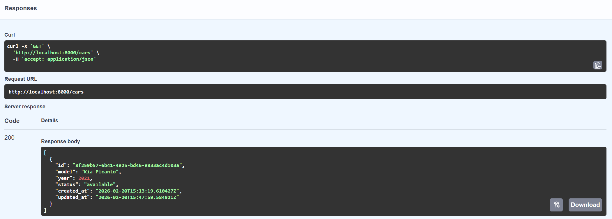

## Testing

```bash
python -m pytest tests/ -v
```
